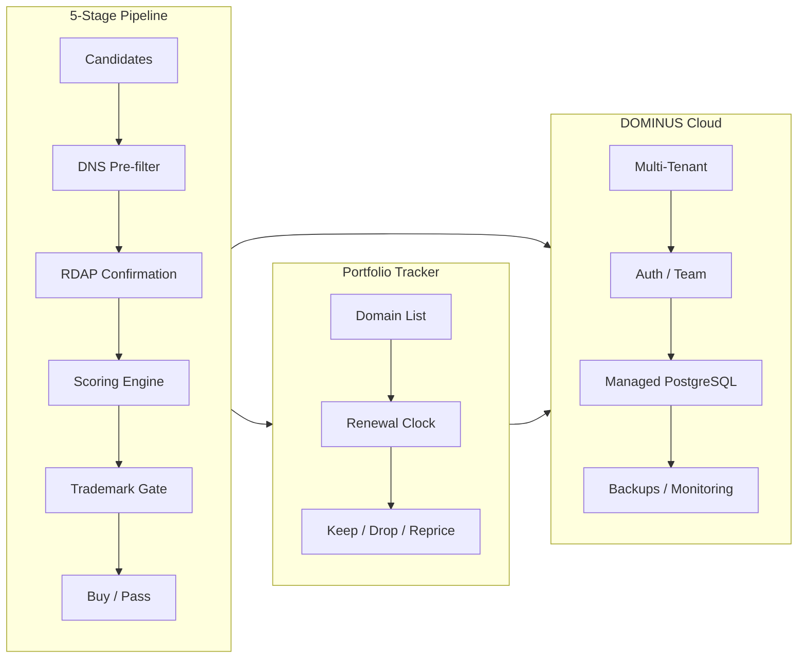

# DOMINUS

> Open-source decision-support engine for buying, reselling, and managing DNS domain portfolios — available as self-hosted community edition or managed cloud service.

[](LICENSE)
[](package.json)
[](tsconfig.json)
[](package.json)
[](https://github.com/AlessioBrillo/dominus/actions/workflows/ci.yml)
[](https://codecov.io/gh/AlessioBrillo/dominus)
[](#)

DOMINUS is an **open-source domain investment tool** that helps you make better purchase, portfolio, and pricing decisions than the market average. It is **free to use**, **free to fork**, **zero-cost on APIs**, and designed to run at **€0 infrastructure cost** in its community edition.

**DOMINUS Community** (AGPL v3) — self-hosted, all features, unlimited use, forever free.

**DOMINUS Cloud** — managed hosting with multi-tenant support, PostgreSQL, automated backups, and priority support. [Coming soon.](#)

---

## Product Overview



## Why Open-Source?

Every aspect of DOMINUS is transparent, forkable, and customizable:

- **No vendor lock-in**: you own your data (portable database), your configuration (`.env`), and your fork. Migrate from DOMINUS Cloud to self-hosted with a single database dump.
- **No black-box algorithms**: the scoring engine is heuristic — every weight, threshold, and signal is visible and tunable.
- **No paid APIs required**: all data sources are free (public RDAP, USPTO, EUIPO) or file-based (keyword CSVs, comparable sales). The tool itself never requires a paid subscription.
- **No surprises**: fork the repo, change anything, deploy anywhere — from a Raspberry Pi to a Kubernetes cluster.

## Pipeline Architecture

```
Candidates → DNS pre-filter → RDAP confirmation → Scoring → Trademark gate → Buy/Pass
```

Five sequential stages, each feeding the next:

1. **Candidate generation** — keyword combos, brandable names, closeout CSV imports
2. **DNS pre-filter** — fast bulk check via Node `dns` module
3. **RDAP confirmation** — precise availability + premium detection via public RDAP
4. **Scoring** — heuristic engine using intrinsic/commercial/market/expiry signals
5. **Trademark gate** — mandatory USPTO + EUIPO check (non-negotiable)

Plus a **portfolio tracker** with renewal clock and monthly keep/drop/reprice verdicts.

Pipeline runs are **async by default** — enqueued to a job queue and executed by a background worker. Use `--sync` for immediate execution.

## Quick Start

```bash
# Clone anywhere, no registration required
git clone https://github.com/AlessioBrillo/dominus.git
cd dominus
npm install
npm run build

# Score some candidates with sample data (no config needed)
KEYWORD_DATA_PATH=examples/keywords-sample.json \
COMPS_DATA_PATH=examples/comps-sample.csv \
node dist/cli.js run --closeout-csv examples/closeout-sample.csv
```

Or with Docker:

```bash
docker build -t dominus .
docker run -d -p 3000:3000 -v ./data:/app/data dominus
```

## Current Stack

| Layer | Technology | Why |
|-------|-----------|-----|
| **Backend** | Node.js 20+, Express 5 | Zero-cost, universally forkable, massive ecosystem |
| **Database** | SQLite (community) / PostgreSQL (cloud) | Abstraction layer supports both — choose your deployment |
| **CLI** | Commander (18 commands) | Full functionality without a browser |
| **API** | Express REST (18 route modules) | Dashboard-ready, swappable frontend |
| **Frontend** | React 19 + Vite 6 + Tailwind 4 | Professional SaaS dashboard with Recharts + TanStack Table |
| **Trademark** | USPTO public API (no key) + EUIPO OAuth2 (free) | Zero-cost compliance |
| **Infrastructure** | Docker, Docker Compose, GitHub Actions | Deploy anywhere, CI built-in |

## Editions

| Feature | DOMINUS Community | DOMINUS Cloud |
|---------|------------------|---------------|
| **License** | AGPL v3 — free forever | AGPL v3 + managed hosting |
| **Scoring engine** | ✓ Full | ✓ Full |
| **5-stage pipeline** | ✓ Full | ✓ Full |
| **Trademark gate** | ✓ Full | ✓ Full |
| **Portfolio tracker** | ✓ Full | ✓ Full |
| **CLI (18 commands)** | ✓ Full | ✓ Full |
| **REST API** | ✓ Full | ✓ Full |
| **Database** | SQLite (single-file) | PostgreSQL (managed) |
| **Auth** | Static API key (`.env`) | JWT + Auth0/Clerk, team accounts |
| **Multi-tenancy** | — | ✓ Managed |
| **Backups** | Manual (`dominus maintenance backup`) | Automated, point-in-time recovery |
| **Support** | GitHub Issues | Email/Slack (4h response) |
| **Cost** | €0 | Free tier + paid plans |

## Fork & Customize

DOMINUS is designed from the ground up to be forked and personalized. Here's what you can change without touching core code:

### Scoring Engine

Every tunable parameter is exposed via environment variables:

- **Signal strengths**: weights for intrinsic, commercial, market, expiry signals (`SCORING_WEIGHTS_OVERRIDE`)
- **Signal calibrations**: ideal length, volume caps, floor values (see `src/config.ts`)
- **TLD bonuses**: override `.com=1.0, .io=0.85` via JSON file (`TLD_BONUSES_PATH`)
- **Budget caps**: `BUY_MAX_ABSOLUTE_CAP`, `SCORING_RECOMMEND_THRESHOLD`
- **Drop logic**: `DROP_SCORE_THRESHOLD`, `DROP_RENEWAL_HORIZON_DAYS`

### Providers

Every external dependency is behind a TypeScript interface. Swap any provider in **one file** (`src/app/composition-root.ts`):

| Interface | Default | Swap to |
|-----------|---------|---------|
| `DnsProvider` | Node DNS (std lib) | Any DNS API |
| `RdapProvider` | rdap.org (free) | Custom RDAP bootstrap |
| `TrademarkProvider` | USPTO + EUIPO (free) | Commercial TM API |
| `KeywordProvider` | Local JSON file | Google Ads API, Ahrefs |
| `CompsProvider` | Local CSV file | NameBio API, Estibot |
| `WhoisProvider` | Port-43 (free) | WhoisXML API |
| `RegistrarProvider` | Manual (no-op) | Namecheap, GoDaddy, Cloudflare API |

See [Customization Guide](docs/customization/README.md) for step-by-step examples.

## Deployment Options

DOMINUS scales from a personal CLI tool to a containerized service managing thousands of domains:

| Scenario | Stack | Command |
|----------|-------|---------|
| **Personal** (1-50 domains) | CLI only | `npx dominus run --closeout-csv ./candidates.csv` |
| **Growing** (50-500) | Docker (SQLite) | `docker compose up -d` |
| **Large** (500+) | Docker + PostgreSQL | `docker compose -f compose.yml -f compose.prod.yml up -d` |
| **Enterprise** (5000+) | Kubernetes + PostgreSQL | `kubectl apply -f deploy/` |
| **Managed** | DOMINUS Cloud | Sign up at [dominus.cloud](#) |

See [Deployment Guide](docs/deployment/README.md).

## Configuration

All configuration is via environment variables. Copy `.env.example` to `.env` and customize:

```bash
cp .env.example .env
# Edit .env with your preferences
```

Key variables:

| Variable | Default | Purpose |
|----------|---------|---------|
| `DATABASE_PATH` | `./data/dominus.db` | SQLite database location |
| `KEYWORD_DATA_PATH` | (optional) | Google Keyword Planner JSON export |
| `COMPS_DATA_PATH` | (optional) | NameBio comparable sales CSV |
| `BUY_MAX_ABSOLUTE_CAP` | `500` | Max recommended purchase price (EUR) |
| `SCORING_WEIGHTS_OVERRIDE` | (optional) | Custom scoring weights JSON |
| `TLD_BONUSES_PATH` | (optional) | Custom TLD multiplier bonuses JSON |
| `EUIPO_CLIENT_ID` | (optional) | EUIPO trademark search (free registration) |
| `API_KEYS` | (optional) | REST API authentication |

See [full reference](docs/customization/configuration.md).

## Commands

```
Usage: dominus <command> [options]

Commands:
  run                 Run the full pipeline
  score               Score a single domain
  portfolio           Manage portfolio (CRUD + rescore)
  outcome             Record outcomes (sold/dropped/expired)
  backtest            Run backtest + suggest weight adjustments
  runs                List/inspect pipeline runs
  candidates          List pipeline candidates
  providers           Show provider status
  scheduler           Run scheduled jobs manually
  watchlist           Monitor domains for availability
  maintenance         Prune cache, DB maintenance
  health              System health check
  buy                 Record a purchase
  registrars          Configure registrar providers
  report              Generate portfolio reports
  analytics           Prediction accuracy and P&L analytics
  bid                 Manage bids
  listing             Manage marketplace listings
```

## Documentation

- [Architecture Decision Records](docs/adr/README.md) — full architectural rationale
- [Customization Guide](docs/customization/README.md) — how to adapt for your needs
- [Deployment Guide](docs/deployment/README.md) — infrastructure options
- [Contributing Guide](CONTRIBUTING.md) — how to contribute
- [Security Policy](SECURITY.md) — vulnerability reporting
- [Roadmap](ROADMAP.md) — planned features and releases

## Project Status

DOMINUS v0.4.0-dev — transitioning to open-source SaaS architecture. All five pipeline stages, the heuristic scoring engine, trademark gate (real USPTO/EUIPO providers + caching), portfolio tracker, outcomes, and backtest engine are implemented and tested. The community edition is fully functional and production-ready.

## License

[AGPL v3](LICENSE) — © 2026 AlessioBrillo. Use freely, fork openly, build anything.

Commercial licenses are available for organizations that require proprietary embedding.
