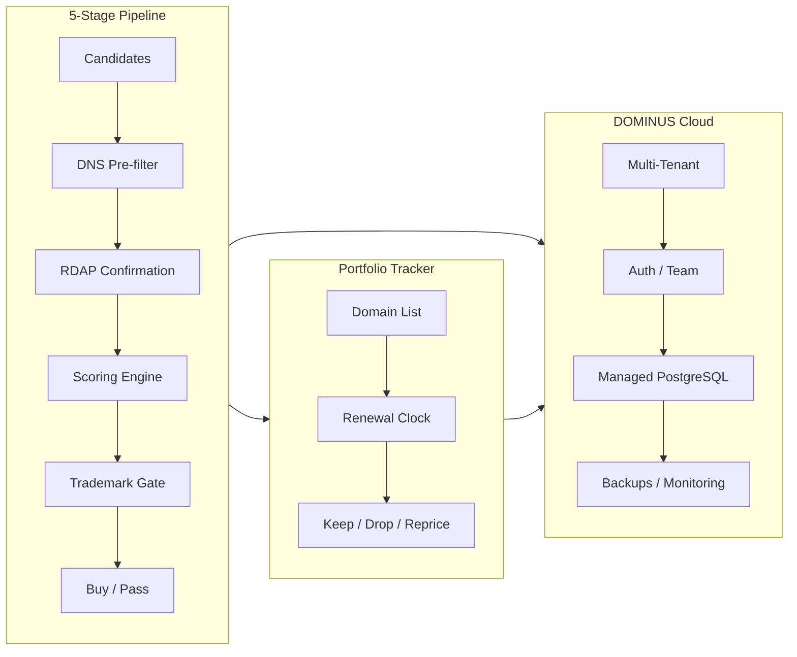

# DOMINUS — Open-Source Domain Valuation & Domain Portfolio Management Software

> Open-source decision-support engine for domain valuation, buying, reselling, and managing DNS domain portfolios — available as a self-hosted community edition or managed cloud service.

[](LICENSE)
[](package.json)
[](tsconfig.json)
[](package.json)
[](https://github.com/AlessioBrillo/dominus/actions/workflows/ci.yml)
[](https://github.com/AlessioBrillo/dominus/actions/workflows/codeql.yml)
[](https://codecov.io/gh/AlessioBrillo/dominus)
[](#)

DOMINUS is an **open-source domain investment tool** that helps you make better domain purchase, portfolio, and pricing decisions than the market average. It combines **domain valuation** (heuristic appraisal of market value, buy ceiling, and list price), **expired domain analysis** (age, backlinks, Wayback history), and **domain portfolio management** (renewal clock, keep/drop/reprice verdicts) with a mandatory **trademark check** before any buy recommendation. It is **free to use**, **free to fork**, **zero-cost on APIs**, and designed to run at **€0 infrastructure cost** in its community edition.

**DOMINUS Community** (AGPL v3) — self-hosted, all features, unlimited use, forever free.

**DOMINUS Cloud** — managed hosting with multi-tenant support, PostgreSQL, automated backups with point-in-time recovery, and priority support. Billing, usage metering, and the admin panel ship ahead of the managed hosting launch (v1.0.0).

---

## Product Overview


```mermaid
flowchart LR
    subgraph Pipeline[5-Stage Pipeline]
        A[Candidates] --> B[DNS Pre-filter]
        B --> C[RDAP Confirmation]
        C --> D[Scoring Engine]
        D --> E[Trademark Gate]
        E --> F[Buy / Pass]
    end

    subgraph Portfolio[Portfolio Tracker]
        G[Domain List] --> H[Renewal Clock]
        H --> I[Keep / Drop / Reprice]
    end

    subgraph Cloud[DOMINUS Cloud]
        J[Multi-Tenant] --> K[Auth / Team]
        K --> L[Managed PostgreSQL]
        L --> M[Backups / Monitoring]
    end

    Pipeline --> Portfolio
    Pipeline --> Cloud
    Portfolio --> Cloud
```

## Why Open-Source?

Every aspect of DOMINUS is transparent, forkable, and customizable:

- **No vendor lock-in**: you own your data (portable database), your configuration (`.env`), and your fork. Migrate from DOMINUS Cloud to self-hosted with a single database dump.
- **No black-box algorithms**: the scoring engine is heuristic — every weight, threshold, and signal is visible and tunable.
- **No paid APIs required**: all data sources are free (public RDAP, USPTO, EUIPO) or file-based (keyword CSVs, comparable sales). The tool itself never requires a paid subscription.
- **No surprises**: fork the repo, change anything, deploy anywhere — from a Raspberry Pi to a Kubernetes cluster.

## Pipeline Architecture

```
Candidates → DNS pre-filter → RDAP confirmation → Scoring → Trademark gate → Buy/Pass
```

Five sequential stages, each feeding the next:

1. **Candidate generation** — keyword combos, brandable names, closeout CSV imports
2. **DNS pre-filter** — fast bulk check via Node `dns` module
3. **RDAP confirmation** — precise availability + premium detection via public RDAP
4. **Scoring** — heuristic engine using intrinsic/commercial/market/expiry signals
5. **Trademark gate** — mandatory USPTO + EUIPO check (non-negotiable)

Plus a **portfolio tracker** with renewal clock and monthly keep/drop/reprice verdicts.

Pipeline runs are **async by default** — enqueued to a job queue and executed by a background worker. Use `--sync` for immediate execution.

## Quick Start

```bash
# Clone anywhere, no registration required
git clone https://github.com/AlessioBrillo/dominus.git
cd dominus
npm install
npm run build

# Score some candidates with sample data (no config needed)
KEYWORD_DATA_PATH=examples/keywords-sample.json \
COMPS_DATA_PATH=examples/comps-sample.csv \
node dist/cli.js run --closeout-csv examples/closeout-sample.csv
```

Or with Docker:

```bash
docker build -t dominus .
docker run -d -p 3000:3000 -v ./data:/app/data dominus
```

## Current Stack

| Layer              | Technology                                      | Why                                                        |
| ------------------ | ----------------------------------------------- | ---------------------------------------------------------- |
| **Backend**        | Node.js 22+, Express 5                          | Zero-cost, universally forkable, massive ecosystem         |
| **Database**       | SQLite (community) / PostgreSQL (cloud)         | Abstraction layer supports both — choose your deployment   |
| **CLI**            | Commander (18 commands)                         | Full functionality without a browser                       |
| **API**            | Express REST (18 route modules)                 | Dashboard-ready, swappable frontend                        |
| **Frontend**       | React 19 + Vite 6 + Tailwind 4                  | Professional SaaS dashboard with Recharts + TanStack Table |
| **Trademark**      | USPTO public API (no key) + EUIPO OAuth2 (free) | Zero-cost compliance                                       |
| **Infrastructure** | Docker, Docker Compose, GitHub Actions          | Deploy anywhere, CI built-in                               |

## Editions

| Feature               | DOMINUS Community                     | DOMINUS Cloud                     |
| --------------------- | ------------------------------------- | --------------------------------- |
| **License**           | AGPL v3 — free forever                | AGPL v3 + managed hosting         |
| **Scoring engine**    | ✓ Full                                | ✓ Full                            |
| **5-stage pipeline**  | ✓ Full                                | ✓ Full                            |
| **Trademark gate**    | ✓ Full                                | ✓ Full                            |
| **Portfolio tracker** | ✓ Full                                | ✓ Full                            |
| **CLI (18 commands)** | ✓ Full                                | ✓ Full                            |
| **REST API**          | ✓ Full                                | ✓ Full                            |
| **Database**          | SQLite (single-file)                  | PostgreSQL (managed)              |
| **Auth**              | Static API key (`.env`)               | JWT + Auth0/Clerk, team accounts  |
| **Multi-tenancy**     | —                                     | ✓ Managed                         |
| **Backups**           | Manual (`dominus maintenance backup`) | Automated, point-in-time recovery |
| **Support**           | GitHub Issues                         | Email/Slack (4h response)         |
| **Cost**              | €0                                    | Free tier + paid plans            |

## Fork & Customize

DOMINUS is designed from the ground up to be forked and personalized. Here's what you can change without touching core code:

### Scoring Engine

Every tunable parameter is exposed via environment variables:

- **Signal strengths**: weights for intrinsic, commercial, market, expiry signals (`SCORING_WEIGHTS_OVERRIDE`)
- **Signal calibrations**: ideal length, volume caps, floor values (see `src/config.ts`)
- **TLD bonuses**: override `.com=1.0, .io=0.85` via JSON file (`TLD_BONUSES_PATH`)
- **Budget caps**: `BUY_MAX_ABSOLUTE_CAP` (0 = uncapped, evidence-anchored value, ADR-0055)
- **Drop logic**: `DROP_SCORE_THRESHOLD`, `DROP_RENEWAL_HORIZON_DAYS`

### Providers

Every external dependency is behind a TypeScript interface. Swap any provider in **one file** (`src/app/composition-root.ts`):

| Interface           | Default              | Swap to                            |
| ------------------- | -------------------- | ---------------------------------- |
| `DnsProvider`       | Node DNS (std lib)   | Any DNS API                        |
| `RdapProvider`      | rdap.org (free)      | Custom RDAP bootstrap              |
| `TrademarkProvider` | USPTO + EUIPO (free) | Commercial TM API                  |
| `KeywordProvider`   | Local JSON file      | Google Ads API, Ahrefs             |
| `CompsProvider`     | Local CSV file       | NameBio API, Estibot               |
| `WhoisProvider`     | Port-43 (free)       | WhoisXML API                       |
| `RegistrarProvider` | Manual (no-op)       | Namecheap, GoDaddy, Cloudflare API |

See [Customization Guide](docs/customization/README.md) for step-by-step examples.

## Deployment Options

DOMINUS scales from a personal CLI tool to a containerized service managing thousands of domains:

| Scenario                    | Stack                   | Command                                                   |
| --------------------------- | ----------------------- | --------------------------------------------------------- |
| **Personal** (1-50 domains) | CLI only                | `npx dominus run --closeout-csv ./candidates.csv`         |
| **Growing** (50-500)        | Docker (SQLite)         | `docker compose up -d`                                    |
| **Large** (500+)            | Docker + PostgreSQL     | `docker compose -f compose.yml -f compose.prod.yml up -d` |
| **Enterprise** (5000+)      | Kubernetes + PostgreSQL | `kubectl apply -f deploy/`                                |
| **Managed**                 | DOMINUS Cloud           | Sign up at [dominus.cloud](#)                             |

See [Deployment Guide](docs/deployment/README.md).

## Configuration

All configuration is via environment variables. Copy `.env.example` to `.env` and customize:

```bash
cp .env.example .env
# Edit .env with your preferences
```

Key variables:

| Variable                   | Default             | Purpose                                                                     |
| -------------------------- | ------------------- | --------------------------------------------------------------------------- |
| `DATABASE_PATH`            | `./data/dominus.db` | SQLite database location                                                    |
| `KEYWORD_DATA_PATH`        | (optional)          | Google Keyword Planner JSON export                                          |
| `COMPS_DATA_PATH`          | (optional)          | NameBio comparable sales CSV                                                |
| `BUY_MAX_ABSOLUTE_CAP`     | `0`                 | Hard cap on recommended buy price (EUR); `0` = evidence-anchored (ADR-0055) |
| `SCORING_WEIGHTS_OVERRIDE` | (optional)          | Custom scoring weights JSON                                                 |
| `TLD_BONUSES_PATH`         | (optional)          | Custom TLD multiplier bonuses JSON                                          |
| `EUIPO_CLIENT_ID`          | (optional)          | EUIPO trademark search (free registration)                                  |
| `API_KEYS`                 | (optional)          | REST API authentication                                                     |

See [full reference](docs/customization/configuration.md).

## Commands

```
Usage: dominus <command> [options]

Commands:
  run                 Run the full pipeline
  score               Score a single domain
  portfolio           Manage portfolio (CRUD + rescore)
  outcome             Record outcomes (sold/dropped/expired)
  backtest            Run backtest + suggest weight adjustments
  runs                List/inspect pipeline runs
  candidates          List pipeline candidates
  providers           Show provider status
  scheduler           Run scheduled jobs manually
  watchlist           Monitor domains for availability
  maintenance         Prune cache, DB maintenance
  health              System health check
  buy                 Record a purchase
  registrars          Configure registrar providers
  report              Generate portfolio reports
  analytics           Prediction accuracy and P&L analytics
  bid                 Manage bids
  listing             Manage marketplace listings
```

## Documentation

- [Architecture Decision Records](docs/adr/README.md) — full architectural rationale
- [Customization Guide](docs/customization/README.md) — how to adapt for your needs
- [Deployment Guide](docs/deployment/README.md) — infrastructure options
- [Contributing Guide](CONTRIBUTING.md) — how to contribute
- [Security Policy](SECURITY.md) — vulnerability reporting
- [Roadmap](ROADMAP.md) — planned features and releases

## Project Status

DOMINUS v0.11.0 — DNS/RDAP/WHOIS consensus hardening and reliability polish. All five pipeline stages, the heuristic scoring engine, trademark gate (real USPTO/EUIPO providers + caching), portfolio tracker with renewal clock and keep/drop verdicts, outcomes, backtest engine, and the professional React dashboard are implemented and tested. The community edition is fully functional and production-ready.

## FAQ

**How does DOMINUS value a domain?**
DOMINUS uses a transparent heuristic appraisal engine with four signal groups: intrinsic quality (length, pronounceability, hyphens/numbers, TLD bonus), commercial demand (keyword search volume × CPC), market comparables (NameBio sales data), and expiry signals for expired/closeout domains (age, backlinks, Wayback snapshots). Every weight is visible and tunable — no black box. The engine is deliberately **more conservative than commercial appraisal tools**.

**Is DOMINUS really free?**
Yes. The community edition is AGPL v3, self-hosted, and runs on free data sources (public RDAP, USPTO, EUIPO, DoH/DoT resolvers). No paid API is required and there is no feature gating — DOMINUS Cloud monetises hosting only.

**What is the trademark gate?**
Before recommending any buy, DOMINUS checks the candidate against USPTO and EUIPO trademark records. Any match blocks the candidate. This check is mandatory and cannot be bypassed — see [ADR-0006](docs/adr/0006-trademark-gate-mandate.md).

**Does DOMINUS support expired domain analysis?**
Yes. Import closeout CSVs of expired domains and DOMINUS carries age, backlinks, and Wayback history into the expiry signal, then runs the same DNS/RDAP availability verification and trademark gate.

**How does DOMINUS check if a domain is available?**
A two-stage gate: a fast DNS pre-filter (bulk, DoH/DoT with 2-of-3 resolver consensus) followed by authoritative RDAP confirmation with opt-in second-opinion consensus. Verdicts are fail-closed — a disagreement downgrades to "unknown" rather than trusting a single resolver.

**How is DOMINUS different from Estibot, GoDaddy Appraisal, or Sedo?**
Those are closed, often sales-leveraged appraisals. DOMINUS is open source (you can audit every weight), conservative by design, and decision-first: the output is a clear _buy/pass_ verdict with a purchase ceiling, not a marketing number. It also manages the portfolio after purchase (renewal clock, keep/drop/reprice) and integrates the trademark gate into the workflow.

**Can I self-host DOMINUS?**
Yes — from a single Raspberry Pi (SQLite) to Docker Compose with PostgreSQL, Redis, Prometheus and Grafana, to Kubernetes. See the [Deployment Guide](docs/deployment/README.md).

## License

**AGPL v3 only** — © 2026 AlessioBrillo. DOMINUS Community is free and
open-source software: you may use, study, share, and modify it, and you may
offer modified versions as a network service **provided you publish your
modifications** under the same license (AGPL §13). See [LICENSE](LICENSE).

Commercial licenses are available for organizations that require proprietary
embedding or proprietary SaaS without AGPL obligations. See
[COMMERCIAL_LICENSE.md](COMMERCIAL_LICENSE.md).

Third-party dependencies and bundled data licenses are listed in
[THIRD-PARTY-NOTICES.md](THIRD-PARTY-NOTICES.md). Dependency licenses are
enforced in CI (`license:check`).

### Trademark

"DOMINUS" is a trademark of AlessioBrillo. The AGPL license grants you the
right to copy, modify, and distribute the code — it does **not** grant you
the right to use the DOMINUS name or logo to promote your fork or a
competing service. Forks and derived services must use a different name and
must not imply affiliation with or endorsement by the DOMINUS project.
Proceed with your own fork and your own brand.
