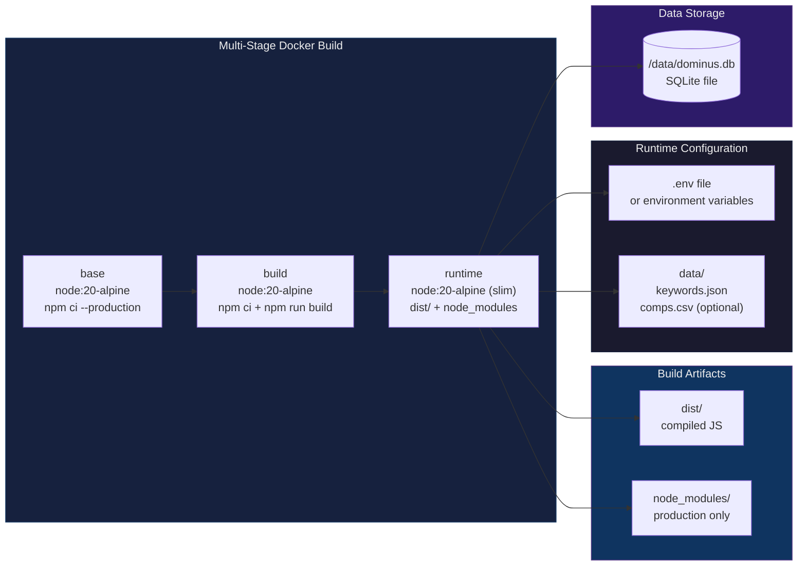
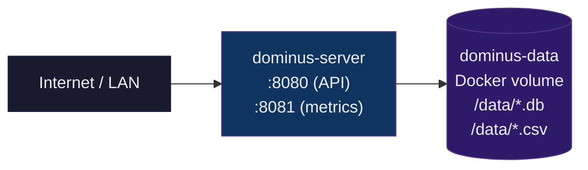

# Deployment Architecture

## Docker Build



## Docker Compose (Community Edition)



## Kubernetes (DOMINUS Cloud)

```mermaid
flowchart TB
    subgraph External[External]
        USERS["Users<br/>Browser / CLI / API"]
        DNS["Cloud DNS<br/>dominus.app"]
    end

    subgraph Cluster[K8s Cluster]
        INGRESS["Ingress<br/>TLS termination<br/>dominus.app → service"]
        SERVICE["dominus-service<br/>ClusterIP :8080"]
        subgraph Pods[Deployment Pods]
            APP["dominus-app<br/>2+ replicas<br/>Express API + Worker"]
        end
        HPA["HorizontalPodAutoscaler<br/>CPU > 70%"]
    end

    subgraph State[Stateful Backing Services]
        PG[("Managed PostgreSQL<br/>HA / automated backups")]
        REDIS[("Redis<br/>(optional cache)"]
        BLOB[("Object Storage<br/>(backups)"]
    end

    subgraph Monitoring[Observability]
        PROM[Prometheus<br/>/metrics scrape]
        GRAF[Grafana<br/>dashboards]
    end

    DNS --> INGRESS
    USERS --> INGRESS
    INGRESS --> SERVICE
    SERVICE --> APP
    HPA --> APP

    APP --> PG
    APP -.-> REDIS
    APP --> BLOB
    APP --> PROM
    PROM --> GRAF

    style External fill:#1a1a2e,stroke:#16213e,color:#eee
    style Cluster fill:#16213e,stroke:#0f3460,color:#eee
    style Pods fill:#0f3460,stroke:#533483,color:#eee
    style State fill:#2d1b69,stroke:#533483,color:#eee
    style Monitoring fill:#1a1a2e,stroke:#16213e,color:#ddd
```

## Resource Requirements

| Edition | CPU | RAM | Storage | Cost |
|---------|-----|-----|---------|------|
| Community (Docker) | 0.5 core | 256 MB | 1 GB (SQLite + data files) | ~€0 (existing hardware) |
| Cloud (K8s minimal) | 1 core | 1 GB | 10 GB (PostgreSQL + backups) | ~€25-50/mo |

## Port Mapping

| Port | Protocol | Purpose | Community | Cloud |
|------|----------|---------|-----------|-------|
| 8080 | HTTP | REST API + dashboard | ✓ | ✓ |
| 8081 | HTTP | Prometheus metrics | ✓ | ✓ |
