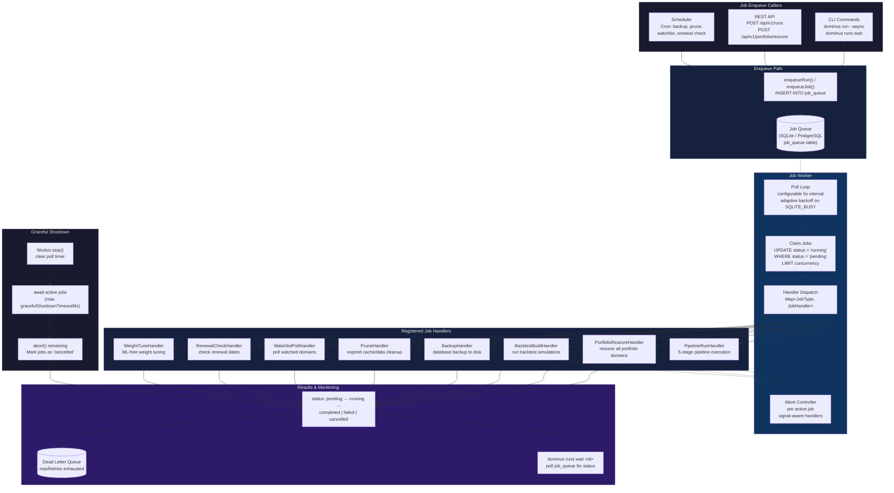

# Async Job Execution



## Configuration

| Parameter | Default | Description |
|-----------|---------|-------------|
| `concurrency` | 2 | Max parallel jobs |
| `pollIntervalMs` | 5000 | Poll interval (adaptive backoff on SQLITE_BUSY) |
| `maxRunningAgeMs` | 300000 (5 min) | Stale job reclamation threshold |
| `gracefulShutdownTimeoutMs` | 30000 (30 s) | Max wait for active jobs on shutdown |

## Job States

```
pending → running → completed
                 → failed (→ pending if retries remain)
                 → cancelled
```

Jobs that exhaust `maxRetries` move to the **dead letter queue** for manual
inspection via the DLQ repository.
