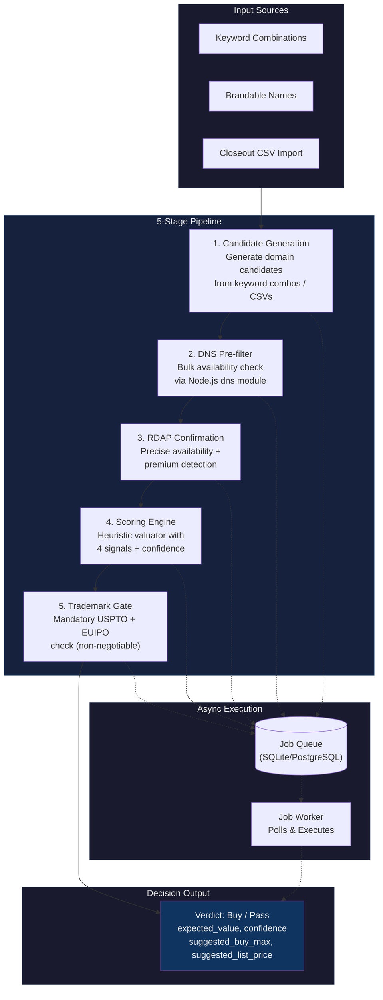

# Pipeline Architecture

## Stage Details

| Stage | Provider | Key Logic |
|-------|----------|-----------|
| 1. Candidate Generation | — | Keyword combos, brandable patterns, closeout CSV parser |
| 2. DNS Pre-filter | `NodeDnsProvider` | Resolves A/AAAA records; registered = dropped |
| 3. RDAP Confirmation | `PublicRdapProvider` + `FailoverRdapProvider` | RDAP lookup → available + not premium |
| 4. Scoring Engine | `ManualKeywordProvider`, `ManualCompsProvider` | 4 signals → weighted aggregate → expected value |
| 5. Trademark Gate | `UsptoProvider` + `EuipoProvider` | Fuzzy token matching + exact match; any hit = blocked |
