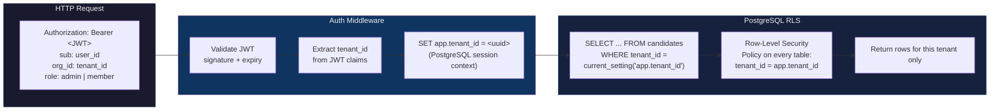

# SaaS Architecture — DOMINUS Cloud

```mermaid
flowchart TB
    subgraph Users[Users]
        BROWSER[Browser<br/>React SPA]
        CLI[CLI<br/>Node.js Terminal]
        API_CLIENT[API Client<br/>curl / Postman]
    end

    subgraph Cloud[DOMINUS Cloud]
        direction TB
        LB[Load Balancer / Reverse Proxy<br/>TLS termination, rate limiting]

        subgraph App[Application Layer]
            AUTH[Auth Middleware<br/>JWT validation, tenant resolution]
            API[REST API<br/>Express 5, 18 route modules]
            WORKER[Job Worker<br/>Async pipeline execution]
            SCHED[Scheduler<br/>Cron jobs, maintenance]
        end

        subgraph Data[Data Layer]
            PG[("PostgreSQL<br/>(managed, RLS)")]
            CACHE[("Redis Cache<br/>(optional)")]
        end

        subgraph Services[External Services]
            USPTO[USPTO API<br/>(free)]
            EUIPO[EUIPO API<br/>(free)]
            RDAP_SERV[RDAP Servers<br/>(free/public)]
            DNS_SERV[DNS Servers]
        end

        subgraph Billing[Billing]
            STRIPE[Stripe<br/>Subscriptions, Invoicing]
        end

        AUTH --> API
        API --> PG
        API --> WORKER
        API --> SCHED
        WORKER --> PG
        SCHED --> PG
        API --> CACHE
        API --> USPTO
        API --> EUIPO
        WORKER --> RDAP_SERV
        WORKER --> DNS_SERV
        API --> STRIPE
    end

    subgraph Community[DOMINUS Community]
        SQLITE[("SQLite<br/>(single file)")]
        STATIC_KEY[Static API Key<br/>(from .env)]
    end

    BROWSER --> LB
    CLI --> LB
    API_CLIENT --> LB
    LB --> AUTH

    SQLITE -.- PG
    STATIC_KEY -.- AUTH

    style Users fill:#1a1a2e,stroke:#16213e,color:#eee
    style Cloud fill:#16213e,stroke:#0f3460,color:#eee
    style App fill:#0f3460,stroke:#533483,color:#eee
    style Data fill:#1a1a2e,stroke:#16213e,color:#eee
    style Services fill:#2d1b69,stroke:#533483,color:#eee
    style Billing fill:#2d1b69,stroke:#533483,color:#eee
    style Community fill:#1a1a2e,stroke:#16213e,color:#ddd
```

## Multi-Tenancy Architecture



## Key Design Decisions

| Decision | Rationale |
|----------|-----------|
| **Shared tables + RLS** | Simpler than schema-per-tenant; RLS provides defence-in-depth isolation |
| **Auth0/Clerk for identity** | Managed password hashing, OAuth, email verification, brute-force protection — reduces security surface for a solo maintainer |
| **Stripe for billing** | Gold standard for SaaS billing; Customer Portal enables self-serve plan changes |
| **SQLite for community** | Zero infrastructure cost, single-file portability, backward compatible with v0.3.x |
| **Same codebase** | No feature branching, no enterprise fork, no dual-track maintenance |

See [ADR-0027](../adr/0027-saas-architecture-multi-tenant.md) for the full
architecture rationale.
