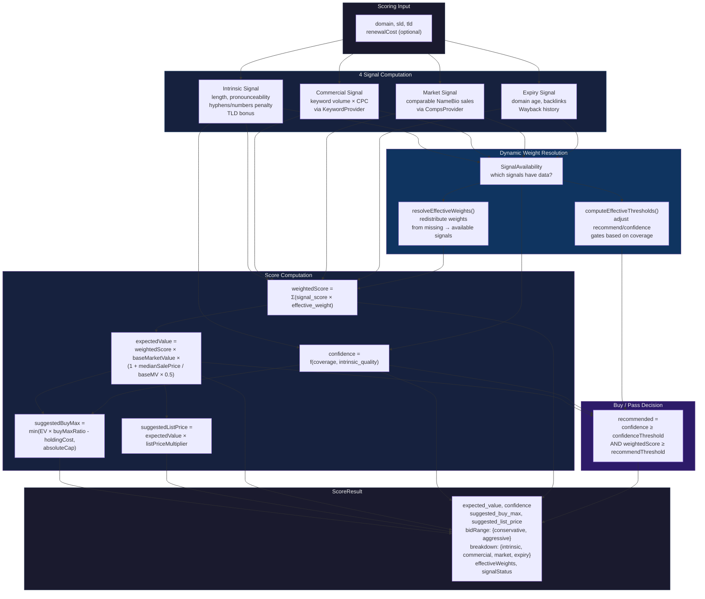

# Scoring Engine



## Signal Details

| Signal | Computation | Data Source | Conservative Tuning |
|--------|-------------|-------------|-------------------|
| **Intrinsic** | Domain length score + pronounceability + hyphen/numbers penalty + TLD bonus | Local heuristics | TLD bonus capped at 0.15; hyphen penalty floors score |
| **Commercial** | Search volume × CPC (normalised) | `KeywordProvider` | Falls back to 0 (no boost) if provider unavailable |
| **Market** | Comparable sales median + recency-weighted average | `CompsProvider` | Falls back to 0; strong signal when available but capped |
| **Expiry** | Age decile + backlinks log-scaled + Wayback age | Closeout CSV import | Only fires for expired/closeout domains |

## Weight Redistribution

When one or more signals lack data, their weight is redistributed proportionally
among the available signals. The intrinsic signal always retains at least its
base weight (no redistribution below the intrinsic floor). This ensures the
engine never produces a score from zero data.

## Confidence Formula

```
coverage = intrinsic_weight +
           (commercial_available ? commercial_weight : 0) +
           (market_available ? market_weight : 0) +
           (expiry_available ? expiry_weight : 0)

signal_confidence = (coverage - intrinsic_min) / (1 - intrinsic_min)
                    × (confidence_cap - confidence_base)
                    × (1 - intrinsic_quality_influence)

quality_boost = intrinsic_score × intrinsic_quality_influence
                × (confidence_cap - confidence_base)

confidence = min(confidence_cap, confidence_base + signal_confidence + quality_boost)
```
